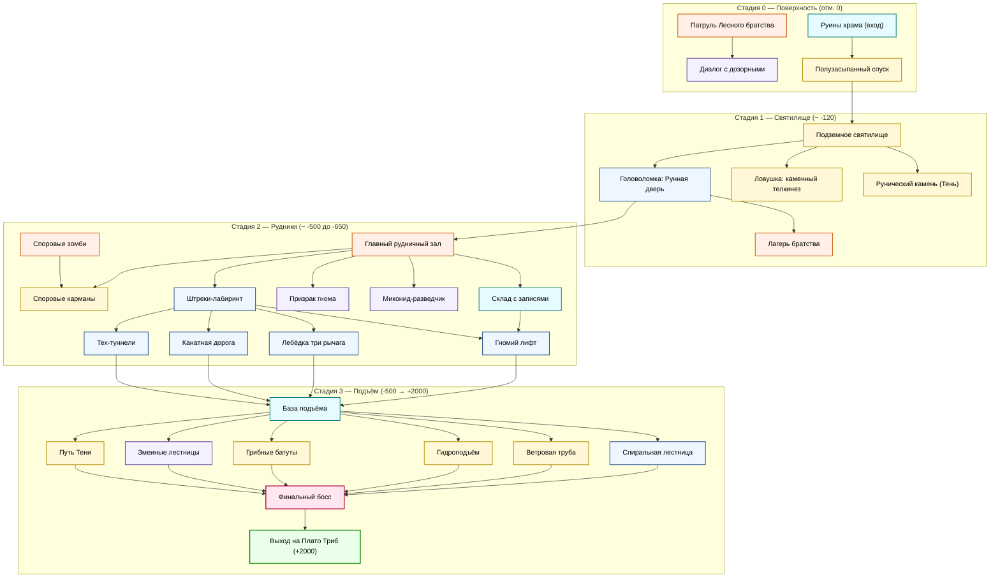

# 3.5 Преодоление Плато

```mermaid
flowchart TD

classDef combat fill:#ffefe6,stroke:#cc5500,stroke-width:1.5px,color:#000
classDef puzzle fill:#eef7ff,stroke:#1f4e8c,stroke-width:1.5px,color:#000
classDef social fill:#f3f0ff,stroke:#5c3fa3,stroke-width:1.5px,color:#000
classDef hazard fill:#fff7d6,stroke:#b38f00,stroke-width:1.5px,color:#000
classDef boss fill:#ffe6f0,stroke:#b3003b,stroke-width:2px,color:#000
classDef exit fill:#e9ffe9,stroke:#038003,stroke-width:2px,color:#000
classDef key fill:#e6fbff,stroke:#0a7a7a,stroke-width:1.5px,color:#000

subgraph S0["Стадия 0 — Поверхность (отм. 0)"]
  S0A["Руины храма (вход)"]:::key
  S0B["Патруль Лесного братства"]:::combat
  S0C["Диалог с дозорными"]:::social
  S0D["Полузасыпанный спуск"]:::hazard
end

subgraph S1["Стадия 1 — Святилище (~ -120)"]
  S1A["Подземное святилище"]:::hazard
  S1B["Лагерь братства"]:::combat
  S1C["Головоломка: Рунная дверь"]:::puzzle
  S1D["Ловушка: каменный телкинез"]:::hazard
  S1E["Рунический камень (Тень)"]:::hazard
end

subgraph S2["Стадия 2 — Рудники (~ -500 до -650)"]
  S2A["Главный рудничный зал"]:::combat
  S2B["Споровые карманы"]:::hazard
  S2C["Склад с записями"]:::key
  S2D["Призрак гнома"]:::social
  S2E["Миконид-разведчик"]:::social
  S2F["Штреки-лабиринт"]:::puzzle
  S2G["Гномий лифт"]:::puzzle
  S2H["Споровые зомби"]:::combat
  S2I["Лебёдка три рычага"]:::puzzle
  S2J["Канатная дорога"]:::puzzle
  S2K["Тех-туннели"]:::puzzle
end

subgraph S3["Стадия 3 — Подъём (-500 → +2000)"]
  S3A["База подъёма"]:::key
  S3B["Спиральная лестница"]:::puzzle
  S3C["Ветровая труба"]:::hazard
  S3D["Гидроподъём"]:::hazard
  S3E["Грибные батуты"]:::hazard
  S3F["Змеиные лестницы"]:::social
  S3G["Путь Тени"]:::hazard
  S3H["Финальный босс"]:::boss
  S3Z["Выход на Плато Триб (+2000)"]:::exit
end

S0A --> S0D --> S1A
S0B --> S0C
S1A --> S1C --> S1B
S1A --> S1D
S1A --> S1E
S1C --> S2A
S2A --> S2B
S2A --> S2C --> S2G
S2A --> S2D
S2A --> S2E
S2A --> S2F
S2F --> S2G
S2F --> S2I
S2F --> S2J
S2F --> S2K
S2H --> S2B
S2G --> S3A
S2I --> S3A
S2J --> S3A
S2K --> S3A
S3A --> S3B
S3A --> S3C
S3A --> S3D
S3A --> S3E
S3A --> S3F
S3A --> S3G
S3B --> S3H
S3C --> S3H
S3D --> S3H
S3E --> S3H
S3F --> S3H
S3G --> S3H
S3H --> S3Z

```
