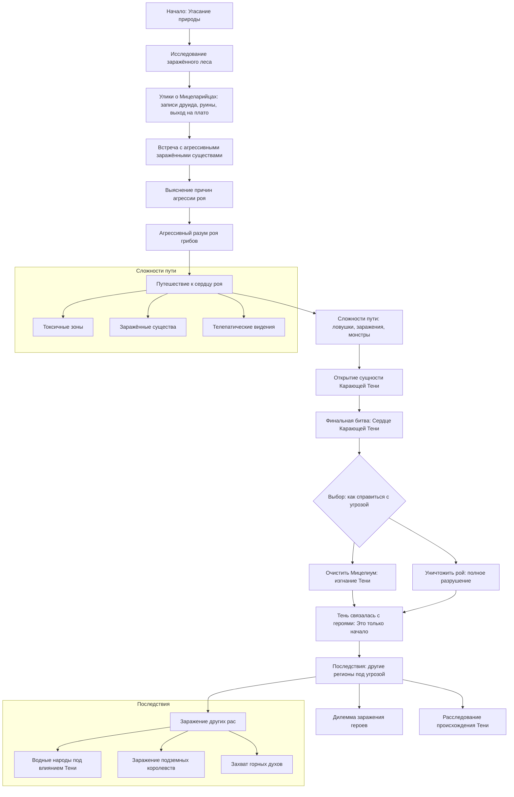
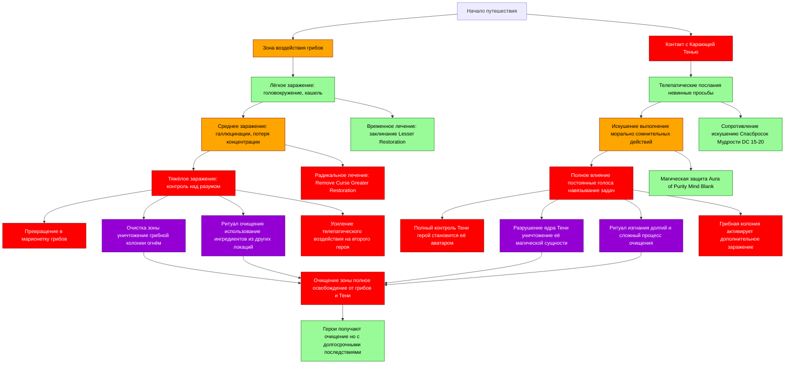
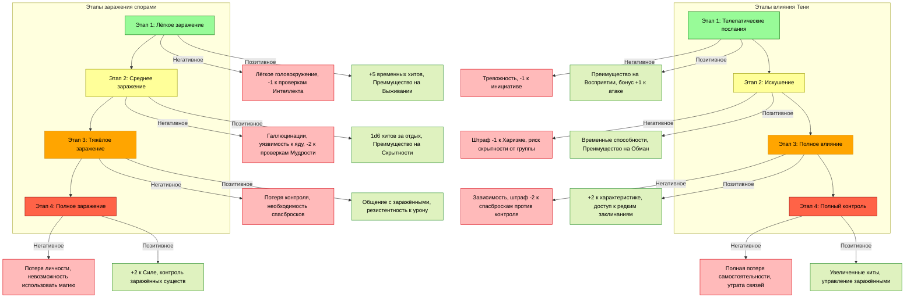

# Глобальный сюжет

```mermaid
graph TD
    A[Начало: Угасание природы] --> B[Исследование заражённого леса]
    B --> C[Улики о Мицеларийцах: записи друида, руины, выход на плато]
    C --> D[Встреча с агрессивными заражёнными существами]
    D --> E[Выяснение причин агрессии роя]
    E --> F[Агрессивный разум роя грибов]
    F --> G[Путешествие к сердцу роя]
    G --> H[Сложности пути: ловушки, заражения, монстры]
    H --> I[Открытие сущности Карающей Тени]
    I --> J[Финальная битва: Сердце Карающей Тени]
    J --> K{Выбор: как справиться с угрозой}
    K --> L[Очистить Мицелиум: изгнание Тени]
    K --> M[Уничтожить рой: полное разрушение]
    L --> N[Тень связалась с героями: Это только начало]
    M --> N
    N --> O[Последствия: другие регионы под угрозой]
    O --> P[Заражение других рас]
    O --> Q[Дилемма заражения героев]
    O --> R[Расследование происхождения Тени]
    
    subgraph Сложности пути
        G --> H1[Токсичные зоны]
        G --> H2[Заражённые существа]
        G --> H3[Телепатические видения]
    end
    
    subgraph Последствия
        P --> P1[Водные народы под влиянием Тени]
        P --> P2[Заражение подземных королевств]
        P --> P3[Захват горных духов]
    end

```

Стратегия завладевания игроками

```mermaid
graph TD

%% Начало воздействия на группу
A[Начало путешествия] --> B[Зона воздействия грибов]:::hazard
A --> C[Контакт с Карающей Тенью]:::critical

%% Влияние спор на первого героя
B --> D1[Лёгкое заражение: головокружение, кашель]:::neutral
D1 --> D2[Среднее заражение: галлюцинации, потеря концентрации]:::hazard
D2 --> D3[Тяжёлое заражение: контроль над разумом]:::critical
D3 --> D4[Превращение в марионетку грибов]:::critical

%% Возможные способы избавления от спор
D1 --> E1[Временное лечение: заклинание Lesser Restoration]:::neutral
D2 --> E2[Радикальное лечение: Remove Curse Greater Restoration]:::critical
D3 --> E3[Очистка зоны уничтожение грибной колонии огнём]:::boss
D3 --> E4[Ритуал очищения использование ингредиентов из других локаций]:::boss

%% Влияние Тени на второго героя
C --> F1[Телепатические послания невинные просьбы]:::neutral
F1 --> F2[Искушение выполнение морально сомнительных действий]:::hazard
F2 --> F3[Полное влияние постоянные голоса навязывание задач]:::critical
F3 --> F4[Полный контроль Тени герой становится её аватаром]:::critical

%% Возможные способы избавления от Тени
F1 --> G1[Сопротивление искушению Спасбросок Мудрости DC 15-20]:::neutral
F2 --> G2[Магическая защита Aura of Purity Mind Blank]:::neutral
F3 --> G3[Разрушение ядра Тени уничтожение её магической сущности]:::boss
F3 --> G4[Ритуал изгнания долгий и сложный процесс очищения]:::boss

%% Взаимодействие заражения и влияния
D3 --> H[Усиление телепатического воздействия на второго героя]:::critical
F3 --> I[Грибная колония активирует дополнительное заражение]:::critical

%% Финальная развязка
E3 --> J[Очищение зоны полное освобождение от грибов и Тени]:::critical
G3 --> J
E4 --> J
G4 --> J
J --> K[Герои получают очищение но с долгосрочными последствиями]:::neutral

%% Стилизация узлов
classDef hazard fill:#FFA500,stroke:#8B0000,color:#000,text-align:center
classDef critical fill:#FF0000,stroke:#800000,color:#FFF,text-align:center
classDef neutral fill:#98FB98,stroke:#006400,color:#000,text-align:center
classDef boss fill:#9400D3,stroke:#4B0082,color:#FFF,text-align:center

```

```mermaid
flowchart TD
    %% Этапы заражения спорами грибов
    subgraph Z[Этапы заражения спорами]
        Z1[Этап 1: Лёгкое заражение]:::lightgreen --> Z2[Этап 2: Среднее заражение]:::yellow
        Z2 --> Z3[Этап 3: Тяжёлое заражение]:::orange
        Z3 --> Z4[Этап 4: Полное заражение]:::red
    end

    %% Негативные и позитивные эффекты споров
    Z1 --> |Негативное| Z1N[Лёгкое головокружение, -1 к проверкам Интеллекта]:::negative
    Z1 --> |Позитивное| Z1P[+5 временных хитов, Преимущество на Выживании]:::positive
    Z2 --> |Негативное| Z2N[Галлюцинации, уязвимость к яду, -2 к проверкам Мудрости]:::negative
    Z2 --> |Позитивное| Z2P[1d6 хитов за отдых, Преимущество на Скрытности]:::positive
    Z3 --> |Негативное| Z3N[Потеря контроля, необходимость спасбросков]:::negative
    Z3 --> |Позитивное| Z3P[Общение с заражёнными, резистентность к урону]:::positive
    Z4 --> |Негативное| Z4N[Потеря личности, невозможность использовать магию]:::negative
    Z4 --> |Позитивное| Z4P[+2 к Силе, контроль заражённых существ]:::positive

    %% Этапы влияния Карающей Тени
    subgraph T[Этапы влияния Тени]
        T1[Этап 1: Телепатические послания]:::lightgreen --> T2[Этап 2: Искушение]:::yellow
        T2 --> T3[Этап 3: Полное влияние]:::orange
        T3 --> T4[Этап 4: Полный контроль]:::red
    end

    %% Негативные и позитивные эффекты Тени
    T1 --> |Негативное| T1N[Тревожность, -1 к инициативе]:::negative
    T1 --> |Позитивное| T1P[Преимущество на Восприятии, бонус +1 к атаке]:::positive
    T2 --> |Негативное| T2N[Штраф -1 к Харизме, риск скрытности от группы]:::negative
    T2 --> |Позитивное| T2P[Временные способности, Преимущество на Обман]:::positive
    T3 --> |Негативное| T3N[Зависимость, штраф -2 к спасброскам против контроля]:::negative
    T3 --> |Позитивное| T3P[+2 к характеристике, доступ к редким заклинаниям]:::positive
    T4 --> |Негативное| T4N[Полная потеря самостоятельности, утрата связей]:::negative
    T4 --> |Позитивное| T4P[Увеличенные хиты, управление заражёнными]:::positive

    %% Стили
    classDef lightgreen fill:#98FB98,stroke:#006400,color:#000
    classDef yellow fill:#FFFF99,stroke:#999900,color:#000
    classDef orange fill:#FFA500,stroke:#CC8400,color:#000
    classDef red fill:#FF6347,stroke:#8B0000,color:#000
    classDef positive fill:#DFF2BF,stroke:#228B22,color:#000
    classDef negative fill:#FFBABA,stroke:#D8000C,color:#000

```

