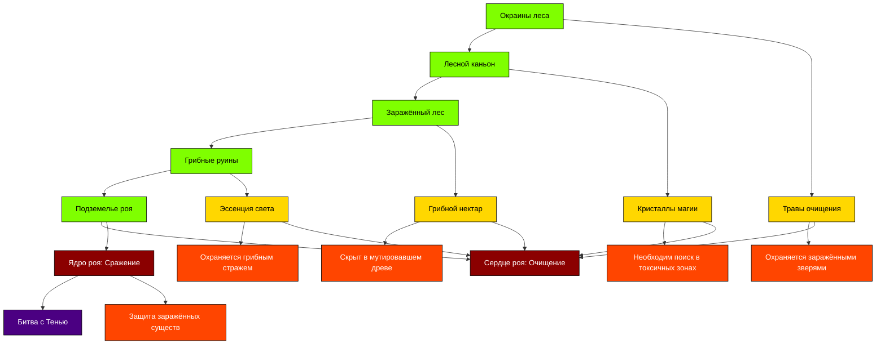
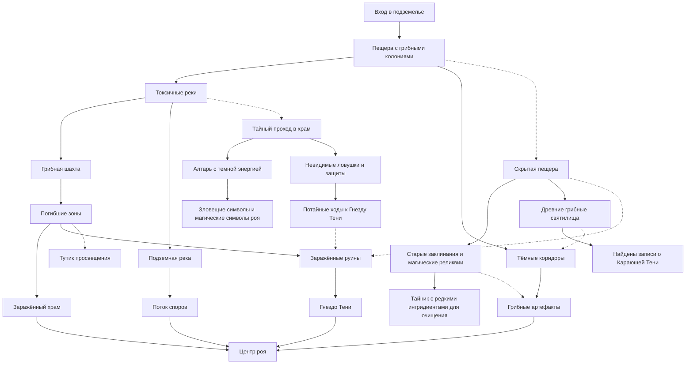
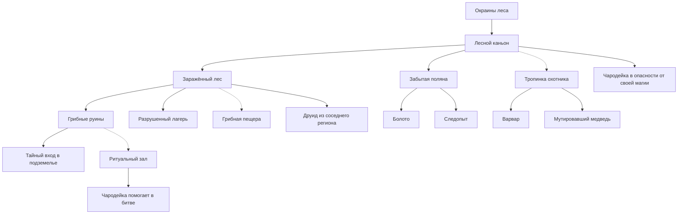

# Карта Кампании

```mermaid
graph TB

%% Основные локации
A[Окраины леса]:::neutral --> B[Лесной каньон]:::neutral
B --> C[Заражённый лес]:::neutral
C --> D[Грибные руины]:::neutral
D --> E[Подземелье роя]:::neutral
E --> F[Сердце роя: Очищение]:::critical
E --> G[Ядро роя: Сражение]:::critical

%% Локации с ингредиентами
A --> H1[Травы очищения]:::ingredient
B --> H2[Кристаллы магии]:::ingredient
C --> H3[Грибной нектар]:::ingredient
D --> H4[Эссенция света]:::ingredient

%% Ключи к локациям с ингредиентами
H1 --> K1[Охраняется заражёнными зверями]:::hazard
H2 --> K2[Необходим поиск в токсичных зонах]:::hazard
H3 --> K3[Скрыт в мутировавшем древе]:::hazard
H4 --> K4[Охраняется грибным стражем]:::hazard

%% Взаимосвязи ингредиентов
H1 --> F
H2 --> F
H3 --> F
H4 --> F

%% Финальные сражения
G --> L1[Битва с Тенью]:::boss
G --> L2[Защита заражённых существ]:::hazard

%% Стили
classDef neutral fill:#7FFF00,stroke:#000,color:#000
classDef ingredient fill:#FFD700,stroke:#000,color:#000
classDef hazard fill:#FF4500,stroke:#000,color:#fff
classDef critical fill:#8B0000,stroke:#000,color:#fff
classDef boss fill:#4B0082,stroke:#000,color:#fff

```

```mermaid
flowchart TD

%% Вход и основные пути
A[Вход в подземелье] --> B[Пещера с грибными колониями]
B --> C[Токсичные реки]
C --> D[Грибная шахта]
D --> E[Погибшие зоны]
E --> F[Заражённый храм]
F --> G[Центр роя]

%% Ответвления
B --> H[Тёмные коридоры]
H --> I[Грибные артефакты]
I --> G

C --> J[Подземная река]
J --> K[Поток споров]
K --> G

E --> L[Заражённые руины]
L --> M[Гнездо Тени]
M --> G

%% Скрытые пути (с другим стилем стрелок)
B -.-> N[Скрытая пещера]
C -.-> O[Тайный проход в храм]
E -.-> P[Тупик просвещения]

%% Содержимое скрытых локаций
N[Скрытая пещера] --> Q[Старые заклинания и магические реликвии]
Q --> R[Тайник с редкими ингридиентами для очищения]
N --> S[Древние грибные святилища]
S --> T[Найдены записи о Карающей Тени]

O[Тайный проход в храм] --> U[Алтарь с темной энергией]
U --> V[Зловещие символы и магические символы роя]
O --> W[Невидимые ловушки и защиты]
W --> X[Потайные ходы к Гнезду Тени]

%% Переходы между ветками
N -.-> L
Q -.-> I
S -.-> H
X -.-> L

%% Стили
classDef neutral fill:#7FFF00,stroke:#000,color:#000
classDef ingredient fill:#FFD700,stroke:#000,color:#000
classDef hazard fill:#FF4500,stroke:#000,color:#fff
classDef critical fill:#8B0000,stroke:#000,color:#fff
classDef boss fill:#4B0082,stroke:#000,color:#fff
classDef hidden fill:#A9A9A9,stroke:#000,color:#000,dashed

```

```mermaid
flowchart TD

%% Основные пути
A[Окраины леса] --> B[Лесной каньон]
B --> C[Заражённый лес]
C --> D[Грибные руины]

%% Ответвления
B --> E[Забытая поляна]
C --> F[Разрушенный лагерь]
D --> G[Тайный вход в подземелье]

%% Скрытые локации
B -.-> H[Тропинка охотника]
C -.-> I[Грибная пещера]
D -.-> J[Ритуальный зал]

%% Локации с NPC
H --> K[Варвар]
H --> Q[Мутировавший медведь]
E --> N[Болото]
E --> O[Следопыт]
B --> L[Чародейка в опасности от своей магии]
C --> M[Друид из соседнего региона]
J --> R[Чародейка помогает в битве]

```

