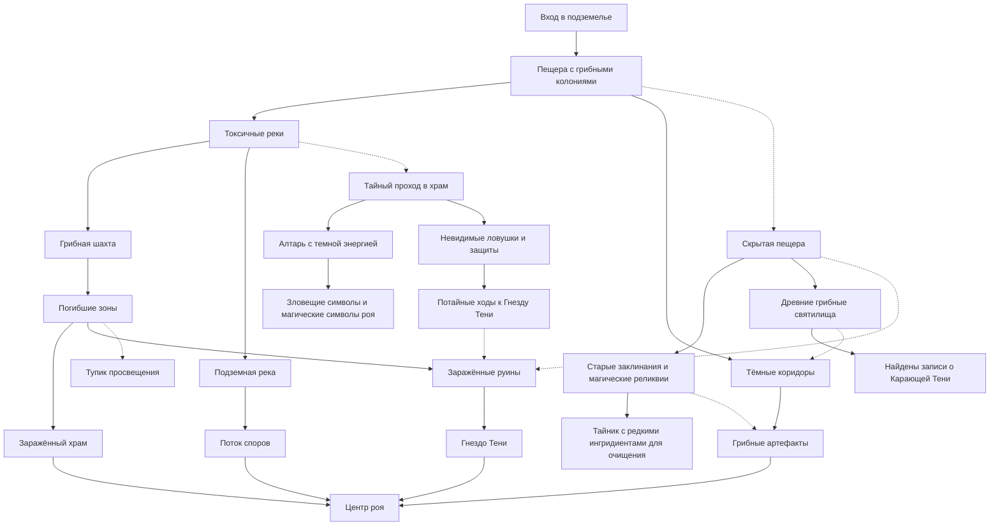
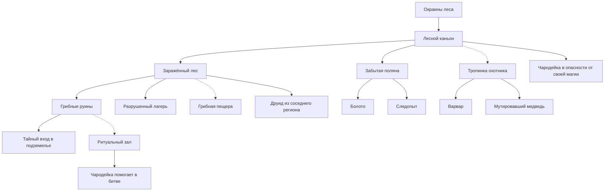
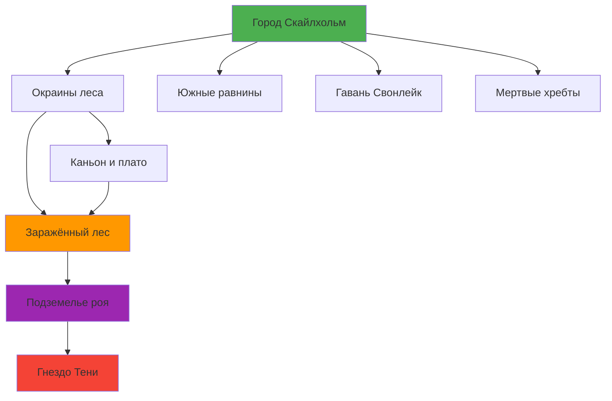
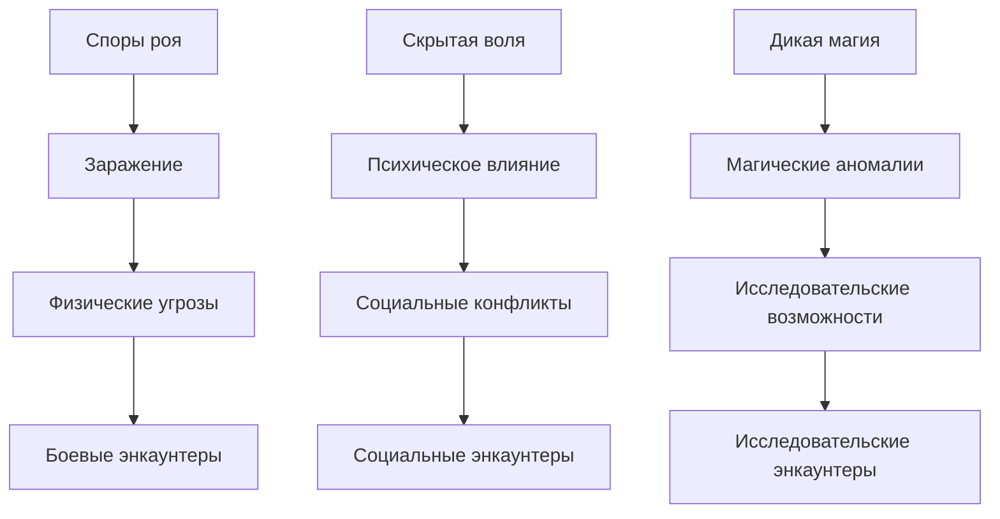

# Карта Кампании

## Обзор регионов

Кампания происходит в регионе Герион, который включает в себя несколько ключевых областей, каждая со своими уникальными локациями, механиками и угрозами.

## Регионы и локации

### 1. Окраины и границы леса

**Описание**: Переходная зона между цивилизацией и заражёнными территориями. Здесь начинается влияние спор и первые признаки аномалий.

#### Точки интереса:

- **Место ритуалов Воздаяния** - древние связи с грибами, место силы
- **Тропа охотника** - следы, скрытые тропы, заражённые волки и кабаны
- **Забытая поляна** - укрытие, растения, малые споровые духи
- **Граница леса** - ориентир, стража, патрули и лесничие
- **Copper Reach** - деревня на перекрёстке, фермерство, заражённый скот
- **Деревня Троппер** - пасека, ремёсла, заражённые пчёлы
- **Кордонная застава** - стража, досмотр, заражённый дезертир
- **Священная грибная роща** - святое место, мицелиане, ритуалы
- **Старый колодец** - вход в подземелье, легенды, пещерный слизень
- **Заброшенный погреб** - кладовые, крысы-носители спор, мимик-бочка

### 2. Южные равнины

**Описание**: Область с высокой концентрацией дикой магии, где адепты изучают и контролируют магические аномалии.

#### Точки интереса:

- **Поле ярко-жёлтых цветов** - аномалия, дикая магия, светлячки-резонаторы
- **Деревня Золотистая** - адепты магии, защита, стражи равнин
- **Деревня Весенний Ключ** - исследования, стабилизация, водяные феи
- **Вихревая долина** - аномалия, магические вихри, элементали ветра
- **Озеро отражений** - аномалия, отражения-дубликаты, водные духи
- **Каменный круг стражей** - аномалия, защита, духи предков
- **Поле пульсирующих камней** - аномалия, земные элементали, каменные големы

### 3. Каньон, плато и горные тропы

**Описание**: Вертикальная зона с ритуальными местами, шахтами и опасными переходами.

#### Точки интереса:

- **Зеркальный ритуальный зал** - ритуалы, плато, зеркала, страж-зеркало
- **Ритуальная терраса плато** - плато, ритуалы, колдуны-резонаторы
- **Склон с лозами** - вертикальность, лозы-удушители, каменные жуки
- **Вход в шахту** - шахта, обвал, заражённые крысы, грибной слизень
- **Забытая поляна** - укрытие, следопыт-союзник, горные шакалы
- **Разрушенный лагерь** - руины, следы битвы, заражённые мародёры

### 4. Заражённый лес и аномалии

**Описание**: Сердце заражения, где споры роя наиболее активны, а влияние Тени максимально.

#### Точки интереса:

- **Заражённая тропа** - споры, пыльца, споровые облака, заражённые кабаны
- **Аномальное озеро** - вода, лей-линии, прорицание, споровые элементали
- **Тихая опушка** - аномальная зона, тишина, усиление Тени, тени-имитаторы
- **Грибная пещера** - споры, вход, споровые облака, заражённые летучие мыши
- **Заброшенная деревня лесников** - заброшенная деревня, споры, память, заражённые духи
- **Древний алтарь Воздаяния** - алтарь, ритуалы, защита, духи древних жрецов
- **Поле пульсирующих грибов** - споры, аномалия, пульсирующие грибы-ловушки
- **Лес колоний мицелиума** - споры, колонии, споровые стражи, рой мух
- **Тёмные коридоры леса** - лабиринт, споры, дезориентация, споровые ловушки
- **Озеро магических мостов** - вода, мосты, лей-линии, магические мосты
- **Пещера артефактов** - артефакты, споры, споровые стражи, сторож-горгулья
- **Шахта древних знаний** - шахта, знания, заражённые горняки, каменный змей
- **Священная чаша** - святыня, защита, ритуалы, священные стражи
- **Зона ослабления Тени** - защита, аномалия, защитные элементали, святые стражи
- **Храм изгнания** - храм, ритуалы, защита, святые жрецы, защитные духи
- **Сердцевина мицелиальной сети** - споры, ядро, надзиратель мицелия, корни-удушители
- **Гнездо Тени** - гнездо, Тень, Карающая Тень, тёмные отражения героев
- **Вход в подземелье** - страж, грибной охранитель, ауры
- **Пещера с грибными колониями** - биомасса, разведчики, разумные грибы-разведчики
- **Тёмные коридоры** - лабиринт, дезориентация, блуждающие споры, грибные ловушки

### 5. Подземелье роя: входная зона

**Описание**: Первые уровни подземелья с токсичными реками, артефактами и первыми серьёзными угрозами.

#### Точки интереса:

- **Токсичные реки** - кислота, мосты, мутировавшие жабы, кислотные плевуны
- **Грибные артефакты** - сокровища, магические предметы, страж артефактов, анимация предметов
- **Грибная шахта** - вертикальность, добыча, грибные горняки, грибные мотыльки
- **Алтарь с тёмной энергией** - ядро, пульс, грибной аватар, тёмные жрецы-эхо

### 6. Подземелье роя: глубины

**Описание**: Самые опасные зоны подземелья, где находятся финальные угрозы и ключевые секреты.

#### Точки интереса:

- **Погибшие зоны** - мёртвая магия, антимагия, антимагические конструкты, страж-подавитель
- **Заражённый храм** - религия, осквернение, осквернённые жрецы, тёмный дух храма
- **Гнездо Тени** - финальная локация, босс, Карающая Тень, тёмные отражения героев

### 7. Город Скайлхольм

**Описание**: Столица региона, где сосредоточена власть, торговля и магические исследования.

#### Точки интереса:

- **Горная крепость** - управление, артефакты, мэр города, советники-магистры
- **Ремесленный квартал** - торговля, снаряжение, заражённые ремесленники, торговцы информацией
- **Городское кладбище** - ритуалы, споры, социальные различия, неспокойные духи
- **Светлая поляна (район)** - храмы, магические школы, студенты магии, мастер магии
- **Грибной рынок** - торговля, грибы, чёрный рынок, контрабандисты спор
- **Академия резонанса** - магическая школа, дикая магия, исследования, мастер резонанса
- **Санитарная служба** - службы, санитария, споры, инспекторы санитарии
- **Оранжерея мицеллиума** - ботаника, симбиоз, грибы, опекающие мицелиане
- **Колокольня маятников** - резонанс, дикая магия, ориентир, хор колоколов
- **Старые катакомбы** - катакомбы, скрытые ходы, споры, заражённые рабочие
- **Центральная площадь** - торговля, новости, общественная жизнь, городские глашатаи
- **Военный квартал** - стража, тренировки, защита, городская стража, заражённые солдаты
- **Библиотека древних знаний** - исследования, история, запрещённые знания, библиотекарь-хранитель
- **Аптека травника** - лечение, травы, зелья, травник-алхимик, заражённые растения
- **Тайная улица** - преступность, подполье, контрабанда, контрабандисты, информаторы

### 8. Мертвые хребты

**Описание**: Элитная зона с мощными ритуалами и гномской магической инженерией.

#### Точки интереса:

- **Горные склепы** - элита, мощные ритуалы, гномы-хранители, духи знати

### 9. Гавань Свонлейк и водные пути

**Описание**: Водная зона с магическими аномалиями, древними руинами и водными существами.

#### Точки интереса:

- **Гавань Свонлейк** - рыболовство, магические материалы, вода, заражённые рыбаки
- **Длинная пристань** - вода, поющие волны, споровые элементали, речные кобольды
- **Водоворот ветров** - лей-линии, дикость эфира, магический всплеск, элементали воздуха
- **Глубины озера Свонлейк** - подводное, древние руины, подводные элементали, заражённые водные существа
- **Крипта приливов** - подводное, руины, проклятие, проклятые моряки-тени, элементаль-старейшина воды

## Механики по регионам

### Споры роя (spores)
- **Усилители**: влажность, безветрие, тёплые полости, кровь
- **Ослабители**: огонь, ветер, святая вода, маски

### Скрытая воля (hidden_will)
- **Усилители**: тишина, монотония, зеркальные поверхности, символы
- **Ослабители**: яркий свет, колокол, соль, железо

### Дикая магия (wild_magic)
- **Усилители**: грозы, полнолуние, кристаллы, ритуальные круги
- **Ослабители**: заземление, контр-песнопения, ритуалы снятия фона

## Связи между регионами

- **Окраины леса** → **Заражённый лес** (постепенное усиление заражения)
- **Заражённый лес** → **Подземелье роя** (основной путь к угрозе)
- **Город** ↔ **Окраины** (торговля, патрули, беженцы)
- **Южные равнины** ↔ **Город** (магические исследования, стабилизация)
- **Гавань** ↔ **Город** (торговые пути, контрабанда)
- **Мертвые хребты** ↔ **Подземелье** (древние ритуалы, артефакты)

## Рекомендации по использованию

### Для мастеров:
- Используйте локации как точки для социальных энкаунтеров
- Комбинируйте механики для создания уникальных ситуаций
- Связывайте локации через NPC и события

### Для игроков:
- Исследуйте регионы систематически
- Обращайте внимание на усилители и ослабители механик
- Используйте информацию из одной локации для понимания других

## Диаграммы связей

Эта карта предоставляет полный обзор всех локаций кампании, организованных по регионам, с указанием механик, угроз и возможностей для каждого места.

