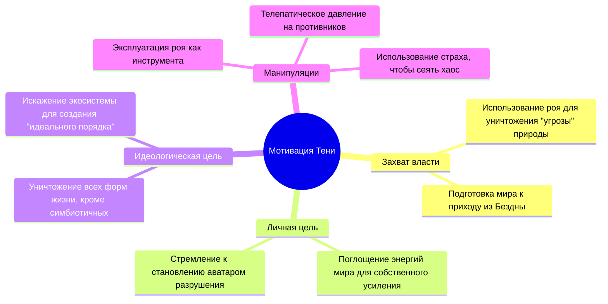
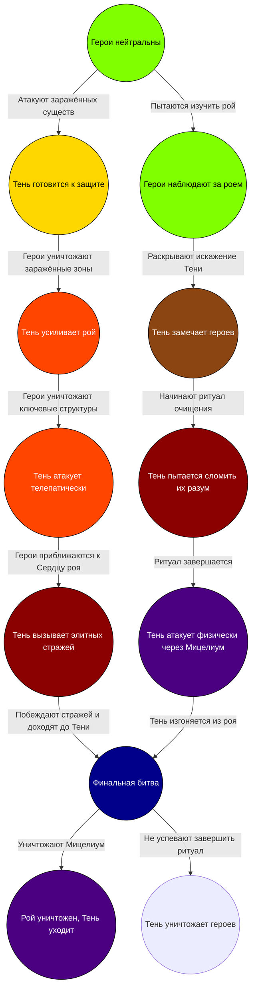
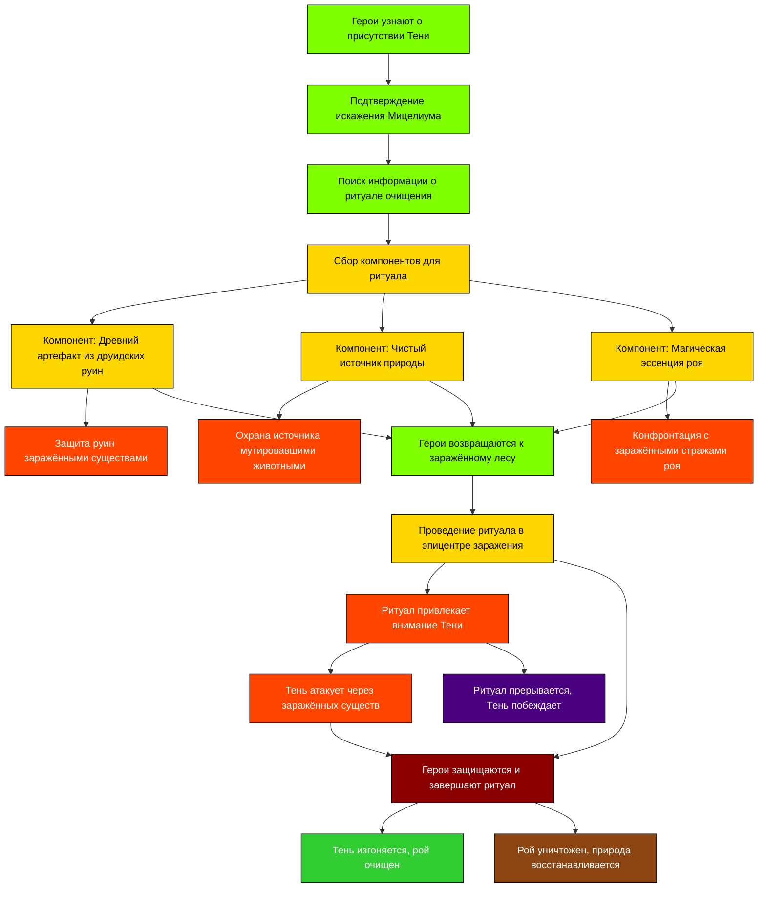
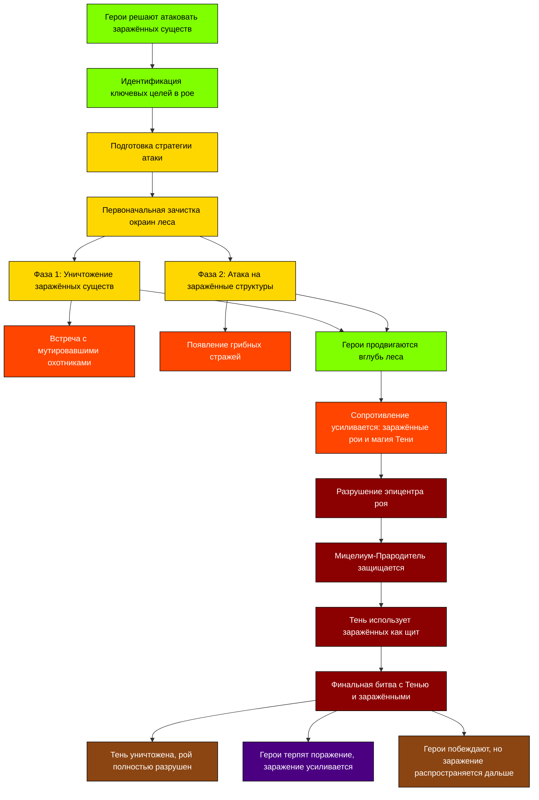

# Мотивация Тени и паттерн поведения

```mermaid
mindmap
  root((Мотивация Тени))
    Захват власти
      Использование роя для уничтожения "угрозы" природы
      Подготовка мира к приходу из Бездны
    Личная цель
      Поглощение энергий мира для собственного усиления
      Стремление к становлению аватаром разрушения
    Идеологическая цель
      Уничтожение всех форм жизни, кроме симбиотичных
      Искажение экосистемы для создания "идеального порядка"
    Манипуляции
      Эксплуатация роя как инструмента
      Телепатическое давление на противников
      Использование страха, чтобы сеять хаос

```

```mermaid
graph TB
    %% Корень
    A((Герои нейтральны)):::neutral -->|Пытаются изучить рой| B((Герои наблюдают за роем)):::neutral
    
    %% Герои проявляют агрессию
    A -->|Атакуют заражённых существ| C((Тень готовится к защите)):::escalation
    C -->|Герои уничтожают заражённые зоны| D((Тень усиливает рой)):::hostile
    D -->|Герои уничтожают ключевые структуры| E((Тень атакует телепатически)):::hostile
    E -->|Герои приближаются к Сердцу роя| F((Тень вызывает элитных стражей)):::critical

    %% Герои исследуют и понимают истинную причину
    B -->|Раскрывают искажение Тени| G((Тень замечает героев)):::aware
    G -->|Начинают ритуал очищения| H((Тень пытается сломить их разум)):::critical
    H -->|Ритуал завершается| I((Тень атакует физически через Мицелиум)):::destruction

    %% Конечные исходы
    F -->|Побеждают стражей и доходят до Тени| J((Финальная битва)):::endgame
    I -->|Тень изгоняется из роя| J
    J -->|Уничтожают Мицелиум| K((Рой уничтожен, Тень уходит)):::destruction
    J -->|Не успевают завершить ритуал| L((Тень уничтожает героев)):::win

    %% Стили
    classDef neutral fill:#7FFF00,stroke:#000,color:#000
    classDef escalation fill:#FFD700,stroke:#000,color:#000
    classDef hostile fill:#FF4500,stroke:#000,color:#fff
    classDef aware fill:#8B4513,stroke:#000,color:#fff
    classDef critical fill:#8B0000,stroke:#000,color:#fff
    classDef destruction fill:#4B0082,stroke:#000,color:#fff
    classDef endgame fill:#00008B,stroke:#000,color:#fff

```

```mermaid
flowchart TD

%% Вариант с ритуалом
A[Герои узнают о присутствии Тени]:::neutral --> B[Подтверждение искажения Мицелиума]:::neutral
B --> C[Поиск информации о ритуале очищения]:::neutral
C --> D[Сбор компонентов для ритуала]:::task

%% Сбор компонентов
D --> E1[Компонент: Древний артефакт из друидских руин]:::task
D --> E2[Компонент: Чистый источник природы]:::task
D --> E3[Компонент: Магическая эссенция роя]:::task

%% Риски при сборе компонентов
E1 --> F1[Защита руин заражёнными существами]:::hazard
E2 --> F2[Охрана источника мутировавшими животными]:::hazard
E3 --> F3[Конфронтация с заражёнными стражами роя]:::hazard

%% Проведение ритуала
E1 --> G[Герои возвращаются к заражённому лесу]:::neutral
E2 --> G
E3 --> G
G --> H[Проведение ритуала в эпицентре заражения]:::task

%% Успех или провал
H --> I1[Ритуал привлекает внимание Тени]:::hazard
I1 --> J1[Тень атакует через заражённых существ]:::hazard
J1 --> K1[Герои защищаются и завершают ритуал]:::critical
H --> K1

%% Исходы
K1 --> L1[Тень изгоняется, рой очищен]:::success
K1 --> L2[Рой уничтожен, природа восстанавливается]:::mixed
I1 --> M1[Ритуал прерывается, Тень побеждает]:::failure

%% Стили
classDef neutral fill:#7FFF00,stroke:#000,color:#000
classDef task fill:#FFD700,stroke:#000,color:#000
classDef hazard fill:#FF4500,stroke:#000,color:#fff
classDef critical fill:#8B0000,stroke:#000,color:#fff
classDef success fill:#32CD32,stroke:#000,color:#fff
classDef mixed fill:#8B4513,stroke:#000,color:#fff
classDef failure fill:#4B0082,stroke:#000,color:#fff

```

```mermaid
flowchart TD

%% Вариант с атакой на существ
A[Герои решают атаковать заражённых существ]:::neutral --> B[Идентификация ключевых целей в рое]:::neutral
B --> C[Подготовка стратегии атаки]:::task
C --> D[Первоначальная зачистка окраин леса]:::task

%% Фазы атаки
D --> E1[Фаза 1: Уничтожение заражённых существ]:::task
D --> E2[Фаза 2: Атака на заражённые структуры]:::task
E1 --> F1[Встреча с мутировавшими охотниками]:::hazard
E2 --> F2[Появление грибных стражей]:::hazard

%% Углубление в лес
E1 --> G[Герои продвигаются вглубь леса]:::neutral
E2 --> G
G --> H[Сопротивление усиливается: заражённые рои и магия Тени]:::hazard
H --> I[Разрушение эпицентра роя]:::critical

%% Финальная конфронтация
I --> J1[Мицелиум-Прародитель защищается]:::critical
J1 --> K1[Тень использует заражённых как щит]:::critical
K1 --> L1[Финальная битва с Тенью и заражёнными]:::critical

%% Исходы
L1 --> M1[Тень уничтожена, рой полностью разрушен]:::mixed
L1 --> M2[Герои терпят поражение, заражение усиливается]:::failure
L1 --> M3[Герои побеждают, но заражение распространяется дальше]:::mixed

%% Стили
classDef neutral fill:#7FFF00,stroke:#000,color:#000
classDef task fill:#FFD700,stroke:#000,color:#000
classDef hazard fill:#FF4500,stroke:#000,color:#fff
classDef critical fill:#8B0000,stroke:#000,color:#fff
classDef mixed fill:#8B4513,stroke:#000,color:#fff
classDef failure fill:#4B0082,stroke:#000,color:#fff

```

