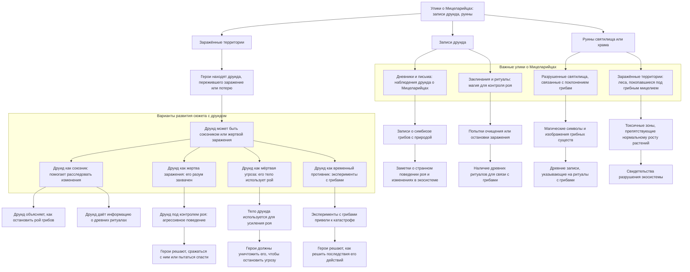

# Нахождение улик

```mermaid
graph TD
    A[Улики о Мицеларийцах: записи друида, руины] --> B1[Записи друида]
    A --> B2[Руины святилища или храма]
    A --> B3[Заражённые территории]

    B1 --> C1[Дневники и письма: наблюдения друида о Мицеларийцах]
    C1 --> C2[Записи о симбиозе грибов с природой]
    C2 --> C3[Заметки о странном поведении роя и изменениях в экосистеме]

    B1 --> D1[Заклинания и ритуалы: магия для контроля роя]
    D1 --> D2[Попытки очищения или остановки заражения]
    D2 --> D3[Наличие древних ритуалов для связи с грибами]

    B2 --> E1[Разрушенные святилища, связанные с поклонением грибам]
    E1 --> E2[Магические символы и изображения грибных существ]
    E2 --> E3[Древние записи, указывающие на ритуалы с грибами]

    B2 --> F1[Заражённые территории: леса, покопавшиеся под грибным мицелием]
    F1 --> F2[Токсичные зоны, препятствующие нормальному росту растений]
    F2 --> F3[Свидетельства разрушения экосистемы]

    B3 --> G1[Герои находят друида, пережившего заражение или потерю]
    G1 --> G2[Друид может быть союзником или жертвой заражения]

    subgraph Варианты развития сюжета с друидом
        G2 --> H1[Друид как союзник: помогает расследовать изменения]
        G2 --> H2[Друид как жертва заражения: его разум захвачен]
        G2 --> H3[Друид как мёртвая угроза: его тело использует рой]
        G2 --> H4[Друид как временный противник: эксперименты с грибами]
    end

    H1 --> I1[Друид объясняет, как остановить рой грибов]
    H1 --> I2[Друид даёт информацию о древних ритуалах]
    H2 --> J1[Друид под контролем роя: агрессивное поведение]
    J1 --> J2[Герои решают, сражаться с ним или пытаться спасти]
    H3 --> K1[Тело друида используется для усиления роя]
    K1 --> K2[Герои должны уничтожить его, чтобы остановить угрозу]
    H4 --> L1[Эксперименты с грибами привели к катастрофе]
    L1 --> L2[Герои решают, как решить последствия его действий]

    subgraph Важные улики о Мицеларийцах
        C1
        D1
        E1
        F1
    end

```

