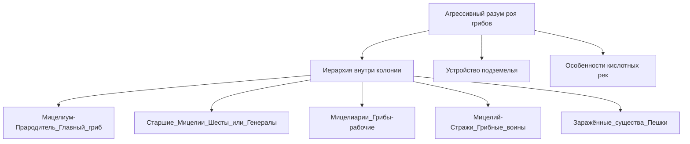

# Описание роя и его подземелья

```mermaid
graph TD
    Z[Агрессивный разум роя грибов] --> Y[Иерархия внутри колонии]
    Z --> X[Устройство подземелья]
    Z --> W[Особенности кислотных рек]
    Y --> Y1[Мицелиум-Прародитель_Главный_гриб]
    Y --> Y2[Старшие_Мицелии_Шесты_или_Генералы]
    Y --> Y3[Мицелиарии_Грибы-рабочие]
    Y --> Y4[Мицелий-Стражи_Грибные_воины]
    Y --> Y5[Заражённые_существа_Пешки]

```

