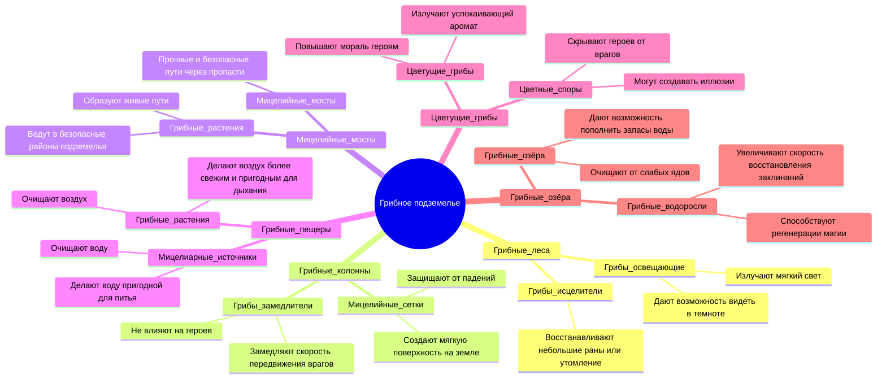

# Другие особенности подземелья

Не все в подземелье стремится убить героев, некоторые небольшие подколонии еще не перешли под власть Тени и имеют разные положительные или нейтральные свойства

```mermaid
mindmap
  root((Грибное подземелье))
    Грибные_леса
      Грибы_исцелители
        Восстанавливают небольшие раны или утомление
      Грибы_освещающие
        Излучают мягкий свет
        Дают возможность видеть в темноте
    Грибные_колонны
      Грибы_замедлители
        Замедляют скорость передвижения врагов
        Не влияют на героев
      Мицелийные_сетки
        Защищают от падений
        Создают мягкую поверхность на земле
    Мицелийные_мосты
      Мицелийные_мосты
        Прочные и безопасные пути через пропасти
      Грибные_растения
        Образуют живые пути
        Ведут в безопасные районы подземелья
    Грибные_пещеры
      Грибные_растения
        Очищают воздух
        Делают воздух более свежим и пригодным для дыхания
      Мицелиарные_источники
        Очищают воду
        Делают воду пригодной для питья
    Цветущие_грибы
      Цветущие_грибы
        Излучают успокаивающий аромат
        Повышают мораль героям
      Цветные_споры
        Могут создавать иллюзии
        Скрывают героев от врагов
    Грибные_озёра
      Грибные_озёра
        Дают возможность пополнить запасы воды
        Очищают от слабых ядов
      Грибные_водоросли
        Способствуют регенерации магии
        Увеличивают скорость восстановления заклинаний

```

