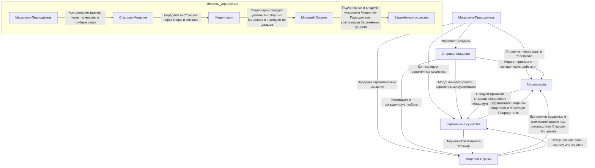

# Иерархия колонии

```mermaid
graph TD
    A[Мицелиум-Прародитель] -->|Управляет разумом| B[Старшие Мицелии]
    A -->|Управляет через ауры и телепатию| C[Мицелиарии]
    A -->|Передает стратегические указания| D[Мицелий-Стражи]
    A -->|Контролирует заражённые существа| E[Заражённые существа]

    B -->|Отдают приказы и контролируют действия| C
    B -->|Командуют и координируют войска| D
    B -->|Могут манипулировать заражёнными существами| E

    C -->|Следуют приказам Старших Мицелиев и Мицелиум-Прародителя| E
    D -->|Выполняют защитные и атакующие задачи под руководством Старших Мицелиев| C
    D -->|Завершающие акты насилия или защиты| E

    E -->|Подчиняются Старшим Мицелиям и Мицелиум-Прародителю| C
    E -->|Подчиняются Мицелий-Стражам| D

    subgraph Гибкость_управления
        A1[Мицелиум-Прародитель] -->|Контролирует разумы через телепатию и грибные связи| B1[Старшие Мицелии]
        B1 -->|Передают инструкции через споры и сигналы| C1[Мицелиарии]
        C1 -->|Мицелиарии следуют указаниям Старших Мицелиев и передают их дальше| D1[Мицелий-Стражи]
        D1 -->|Подчиняются и следуют указаниям Мицелиум-Прародителя, контролируя Заражённых существ| E1[Заражённые существа]
    end

```

