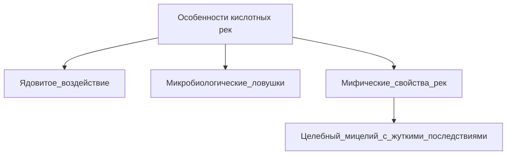

# Устройство кислотных рек

```mermaid
graph TD
    W[Особенности кислотных рек] --> W1[Ядовитое_воздействие]
    W --> W2[Микробиологические_ловушки]
    W --> W3[Мифические_свойства_рек]
    W3 --> W3a[Целебный_мицелий_с_жуткими_последствиями]
```

