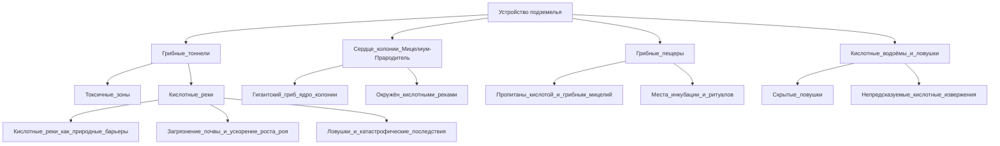

# Устройство подземелья

```mermaid
graph TD
    X[Устройство подземелья] --> X1[Грибные_тоннели]
    X1 --> X1a[Токсичные_зоны]
    X1 --> X1b[Кислотные_реки]
    X1b --> X1b1[Кислотные_реки_как_природные_барьеры]
    X1b --> X1b2[Загрязнение_почвы_и_ускорение_роста_роя]
    X1b --> X1b3[Ловушки_и_катастрофические_последствия]

    X --> X2[Сердце_колонии_Мицелиум-Прародитель]
    X2 --> X2a[Гигантский_гриб_ядро_колонии]
    X2 --> X2b[Окружён_кислотными_реками]
    
    X --> X3[Грибные_пещеры]
    X3 --> X3a[Пропитаны_кислотой_и_грибным_мицелий]
    X3 --> X3b[Места_инкубации_и_ритуалов]

    X --> X4[Кислотные_водоёмы_и_ловушки]
    X4 --> X4a[Скрытые_ловушки]
    X4 --> X4b[Непредсказуемые_кислотные_извержения]

```

