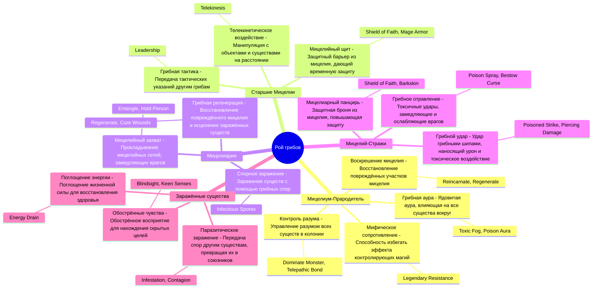

# Заклинания/свойства

```mermaid
mindmap
  root((Рой грибов))
    Мицелиум-Прародитель
      Контроль разума - Управление разумом всех существ в колонии
        Dominate Monster, Telepathic Bond
      Воскрешение мицелия - Восстановление повреждённых участков мицелия
        Reincarnate, Regenerate
      Грибная аура - Ядовитая аура, влияющая на все существа вокруг
        Toxic Fog, Poison Aura
      Мифическое сопротивление - Способность избегать эффекта контролирующих магий
        Legendary Resistance
    Старшие Мицелии
      Грибная тактика - Передача тактических указаний другим грибам
        Leadership
      Телекинетическое воздействие - Манипуляция с объектами и существами на расстоянии
        Telekinesis
      Мицелийный щит - Защитный барьер из мицелия, дающий временную защиту
        Shield of Faith, Mage Armor
    Мицелиарии
      Грибная регенерация - Восстановление повреждённого мицелия и исцеление заражённых существ
        Regenerate, Cure Wounds
      Спорное заражение - Заражение существ с помощью грибных спор
        Infectious Spores
      Мицелийный захват - Прокладывание мицелийных сетей, замедляющих врагов
        Entangle, Hold Person
    Мицелий-Стражи
      Грибной удар - Удар грибными шипами, наносящий урон и токсическое воздействие
        Poisoned Strike, Piercing Damage
      Мицелиарный панцирь - Защитная броня из мицелия, повышающая защиту
        Shield of Faith, Barkskin
      Грибное отравление - Токсичные удары, замедляющие и ослабляющие врагов
        Poison Spray, Bestow Curse
    Заражённые существа
      Поглощение энергии - Поглощение жизненной силы для восстановления здоровья
        Energy Drain
      Паразитическое заражение - Передача спор другим существам, превращая их в союзников
        Infestation, Contagion
      Обострённые чувства - Обострённое восприятие для нахождения скрытых целей
        Blindsight, Keen Senses

```

