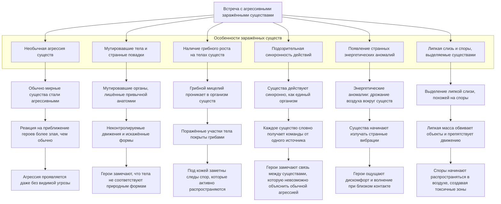

# Особенности монстров

Необходима встреча до начала сюжета с рассой разумных грибов, чтобы у героев естественным образом мог возникнуть вопрос об их необычной агрессивности

```mermaid fullWidth="true"
graph TD
    A[Встреча с агрессивными заражёнными существами] --> B1[Необычная агрессия существ]
    A --> B2[Мутировавшие тела и странные повадки]
    A --> B3[Наличие грибного роста на телах существ]
    A --> B4[Подозрительная синхронность действий]
    A --> B5[Появление странных энергетических аномалий]
    A --> B6[Липкая слизь и споры, выделяемые существами]

    B1 --> C1[Обычно мирные существа стали агрессивными]
    C1 --> C2[Реакция на приближение героев более злая, чем обычно]
    C2 --> C3[Агрессия проявляется даже без видимой угрозы]

    B2 --> D1[Мутировавшие органы, лишённые привычной анатомии]
    D1 --> D2[Неконтролируемые движения и искажённые формы]
    D2 --> D3[Герои замечают, что тела не соответствуют природным формам]

    B3 --> E1[Грибной мицелий проникает в организм существ]
    E1 --> E2[Поражённые участки тела покрыты грибами]
    E2 --> E3[Под кожей заметны следы спор, которые активно распространяются]

    B4 --> F1[Существа действуют синхронно, как единый организм]
    F1 --> F2[Каждое существо словно получает команды от одного источника]
    F2 --> F3[Герои замечают связь между существами, которую невозможно объяснить обычной агрессией]

    B5 --> G1[Энергетические аномалии: дрожание воздуха вокруг существ]
    G1 --> G2[Существа начинают излучать странные вибрации]
    G2 --> G3[Герои ощущают дискомфорт и волнение при близком контакте]

    B6 --> H1[Выделение липкой слизи, похожей на споры]
    H1 --> H2[Липкая масса обвивает объекты и препятствует движению]
    H2 --> H3[Споры начинают распространяться в воздухе, создавая токсичные зоны]

    subgraph Особенности заражённых существ
        B1
        B2
        B3
        B4
        B5
        B6
    end

```

