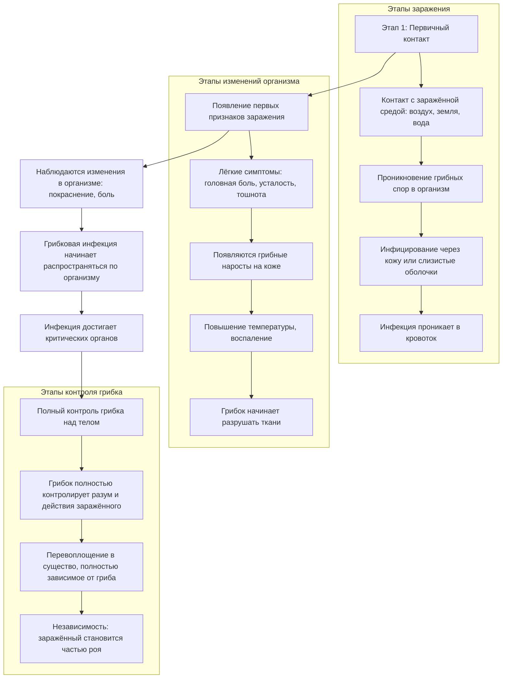

# Этапы поражения грибком

```mermaid
graph TD
    A[Этап 1: Первичный контакт] --> B[Появление первых признаков заражения]
    B --> C[Наблюдаются изменения в организме: покраснение, боль]
    C --> D[Грибковая инфекция начинает распространяться по организму]
    D --> E[Инфекция достигает критических органов]
    E --> F[Полный контроль грибка над телом]

    subgraph Этапы заражения
        A --> G[Контакт с заражённой средой: воздух, земля, вода]
        G --> H[Проникновение грибных спор в организм]
        H --> I[Инфицирование через кожу или слизистые оболочки]
        I --> J[Инфекция проникает в кровоток]
    end

    subgraph Этапы изменений организма
        B --> K1[Лёгкие симптомы: головная боль, усталость, тошнота]
        K1 --> K2[Появляются грибные наросты на коже]
        K2 --> K3[Повышение температуры, воспаление]
        K3 --> K4[Грибок начинает разрушать ткани]
    end

    subgraph Этапы контроля грибка
        F --> L[Грибок полностью контролирует разум и действия заражённого]
        L --> M[Перевоплощение в существо, полностью зависимое от гриба]
        M --> N[Независимость: заражённый становится частью роя]
    end

```

