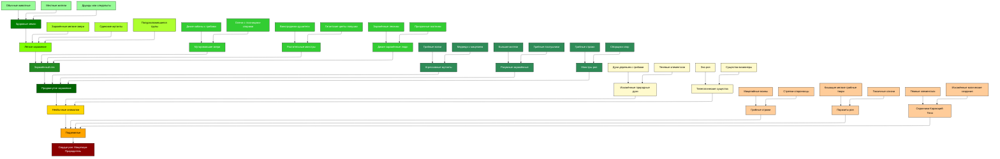

# Изменения флоры/фауны в зависимости от этапа

```mermaid
---
config:
  layout: elk
---
flowchart TB
    %% Этап 1: Здоровые земли
    A[Здоровые земли]:::green --> B[Лёгкое заражение]:::lightgreen

    A1[Обычные животные]:::green_sub --> A
    A2[Местные жители]:::green_sub --> A
    A3[Друиды или следопыты]:::green_sub --> A

    %% Этап 2: Лёгкое заражение
    B --> C[Заражённый лес]:::midgreen

    B1[Заражённые мелкие звери]:::lightgreen_sub --> B
    B2[Одинокие мутанты]:::lightgreen_sub --> B
    B3[Полуразложившиеся трупы]:::lightgreen_sub --> B

    %% Этап 3: Заражённый лес
    C --> D[Продвинутое заражение]:::darkgreen

    C1[Мутировавшие звери]:::midgreen_sub --> C
    C1_1[Дикие кабаны с грибами]:::midgreen_sub --> C1
    C1_2[Олени с глазницами-спорами]:::midgreen_sub --> C1

    C2[Растительные монстры]:::midgreen_sub --> C
    C2_1[Виноградники-душители]:::midgreen_sub --> C2
    C2_2[Гигантские цветы-ловушки]:::midgreen_sub --> C2

    C3[Дикие заражённые люди]:::midgreen_sub --> C
    C3_1[Заражённые лесники]:::midgreen_sub --> C3
    C3_2[Призрачные охотники]:::midgreen_sub --> C3

    %% Этап 4: Продвинутое заражение
    D --> E[Необычные аномалии]:::yellow

    D1[Агрессивные мутанты]:::darkgreen_sub --> D
    D1_1[Грибные волки]:::darkgreen_sub --> D1
    D1_2[Медведи с мицелием]:::darkgreen_sub --> D1

    D2[Разумные заражённые]:::darkgreen_sub --> D
    D2_1[Бывшие жители]:::darkgreen_sub --> D2
    D2_2[Грибные послушники]:::darkgreen_sub --> D2

    D3[Монстры роя]:::darkgreen_sub --> D
    D3_1[Грибные стражи]:::darkgreen_sub --> D3
    D3_2[Сборщики спор]:::darkgreen_sub --> D3

    %% Этап 5: Необычные аномалии
    E --> F[Подземелье]:::orange

    E1[Искажённые природные духи]:::yellow_sub --> E
    E1_1[Духи деревьев с грибами]:::yellow_sub --> E1
    E1_2[Теневые элементали]:::yellow_sub --> E1

    E2[Телепатические существа]:::yellow_sub --> E
    E2_1[Эхо роя]:::yellow_sub --> E2
    E2_2[Существа-визионеры]:::yellow_sub --> E2

    %% Этап 6: Подземелье
    F --> G[Сердце роя: Мицелиум-Прародитель]:::red

    F1[Грибные стражи]:::orange_sub --> F
    F1_1[Мицелийные воины]:::orange_sub --> F1
    F1_2[Стрелки-спороносцы]:::orange_sub --> F1

    F2[Паразиты роя]:::orange_sub --> F
    F2_1[Кишащие мелкие грибные твари]:::orange_sub --> F2
    F2_2[Токсичные слизни]:::orange_sub --> F2

    F3[Охранники Карающей Тени]:::orange_sub --> F
    F3_1[Тёмные элементали]:::orange_sub --> F3
    F3_2[Искажённые магические создания]:::orange_sub --> F3

    %% Стили
    classDef green fill:#008000,stroke:#000,color:#fff
    classDef green_sub fill:#98FB98,stroke:#000,color:#000
    classDef lightgreen fill:#7FFF00,stroke:#000,color:#000
    classDef lightgreen_sub fill:#ADFF2F,stroke:#000,color:#000
    classDef midgreen fill:#228B22,stroke:#000,color:#fff
    classDef midgreen_sub fill:#32CD32,stroke:#000,color:#fff
    classDef darkgreen fill:#006400,stroke:#000,color:#fff
    classDef darkgreen_sub fill:#2E8B57,stroke:#000,color:#fff
    classDef yellow fill:#FFD700,stroke:#000,color:#000
    classDef yellow_sub fill:#FFFACD,stroke:#000,color:#000
    classDef orange fill:#FFA500,stroke:#000,color:#000
    classDef orange_sub fill:#FFCC99,stroke:#000,color:#000
    classDef red fill:#8B0000,stroke:#000,color:#fff

```

