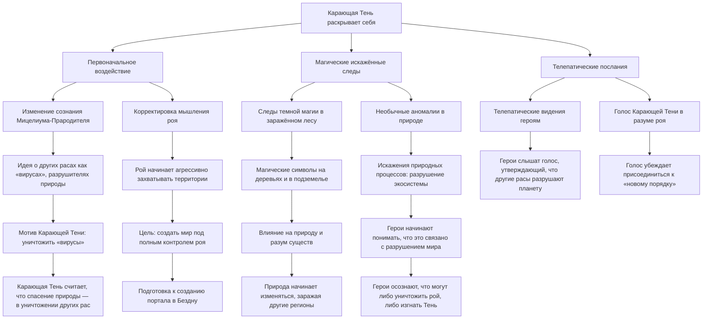

# Постепенное выяснение причины зла

```mermaid
graph TD
    A[Карающая Тень раскрывает себя] --> B[Первоначальное воздействие]
    A --> C[Магические искажённые следы]
    A --> D[Телепатические послания]

    B --> E[Изменение сознания Мицелиума-Прародителя]
    B --> F[Корректировка мышления роя]
    
    C --> G[Следы темной магии в заражённом лесу]
    C --> H[Необычные аномалии в природе]

    D --> I[Телепатические видения героям]
    D --> J[Голос Карающей Тени в разуме роя]

    E --> K[Идея о других расах как «вирусах», разрушителях природы]
    F --> L[Рой начинает агрессивно захватывать территории]
    G --> M[Магические символы на деревьях и в подземелье]
    H --> N[Искажения природных процессов: разрушение экосистемы]
    I --> O[Герои слышат голос, утверждающий, что другие расы разрушают планету]
    J --> P[Голос убеждает присоединиться к «новому порядку»]

    K --> Q[Мотив Карающей Тени: уничтожить «вирусы»]
    L --> R[Цель: создать мир под полным контролем роя]
    M --> S[Влияние на природу и разум существ]
    N --> T[Герои начинают понимать, что это связано с разрушением мира]

    Q --> U[Карающая Тень считает, что спасение природы — в уничтожении других рас]
    R --> V[Подготовка к созданию портала в Бездну]
    S --> W[Природа начинает изменяться, заражая другие регионы]
    T --> X[Герои осознают, что могут либо уничтожить рой, либо изгнать Тень]

```

