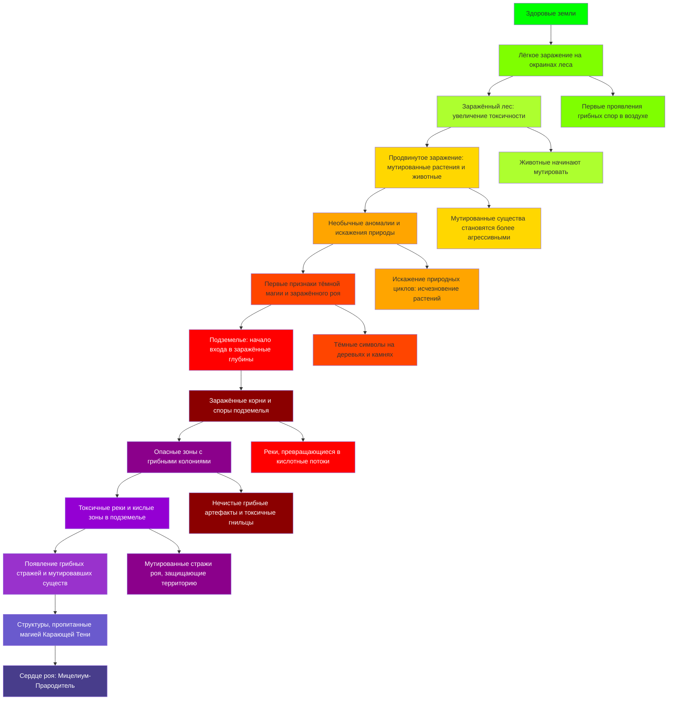

# Продвижение вглубь роя

```mermaid
flowchart TD
    A[Здоровые земли] --> B[Лёгкое заражение на окраинах леса]
    B --> C[Заражённый лес: увеличение токсичности]
    C --> D[Продвинутое заражение: мутированные растения и животные]
    D --> E[Необычные аномалии и искажения природы]
    E --> F[Первые признаки тёмной магии и заражённого роя]
    F --> G[Подземелье: начало входа в заражённые глубины]

    G --> H[Заражённые корни и споры подземелья]
    H --> I[Опасные зоны с грибными колониями]
    I --> J[Токсичные реки и кислые зоны в подземелье]
    J --> K[Появление грибных стражей и мутировавших существ]
    K --> L[Структуры, пропитанные магией Карающей Тени]
    L --> M[Сердце роя: Мицелиум-Прародитель]

    B --> Z1[Первые проявления грибных спор в воздухе]
    C --> Z2[Животные начинают мутировать]
    D --> Z3[Мутированные существа становятся более агрессивными]
    E --> Z4[Искажение природных циклов: исчезновение растений]
    F --> Z5[Тёмные символы на деревьях и камнях]
    H --> Z6[Реки, превращающиеся в кислотные потоки]
    I --> Z7[Нечистые грибные артефакты и токсичные гнильцы]
    J --> Z8[Мутированные стражи роя, защищающие территорию]

    style A fill:#00FF00
    style B fill:#7FFF00
    style C fill:#ADFF2F
    style D fill:#FFD700
    style E fill:#FFA500
    style F fill:#FF4500
    style G fill:#FF0000, color:#FFFFFF
    style H fill:#8B0000, color:#FFFFFF
    style I fill:#8B008B, color:#FFFFFF
    style J fill:#9400D3, color:#FFFFFF
    style K fill:#9932CC, color:#FFFFFF
    style L fill:#6A5ACD, color:#FFFFFF
    style M fill:#483D8B, color:#FFFFFF

    style Z1 fill:#7FFF00
    style Z2 fill:#ADFF2F
    style Z3 fill:#FFD700
    style Z4 fill:#FFA500
    style Z5 fill:#FF4500
    style Z6 fill:#FF0000, color:#FFFFFF
    style Z7 fill:#8B0000, color:#FFFFFF
    style Z8 fill:#8B008B, color:#FFFFFF

```

